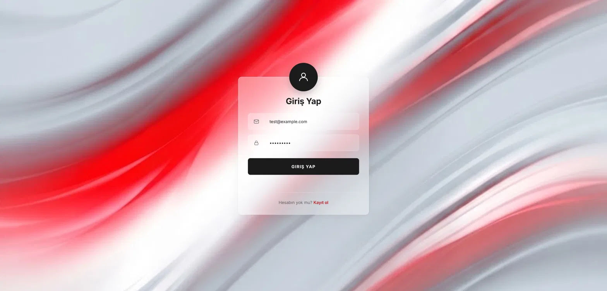

# Login System (2026)

VBT stajı kapsamında geliştirilen kimlik doğrulama (authentication) sistemi.
Backend .NET ile yazıldı; web ve mobil client'lar aynı API'yi kullanır.

## Ekran Görüntüleri

### Web

| Giriş | Kayıt |
|---|---|
|  |  |

| Profil (korumalı) |
|---|
|  |

Tasarım Google Stitch ile üretildi, Stitch MCP üzerinden Claude Code ile koda
aktarıldı. Ayrıntılar: [`web/README.md`](./web/README.md)

## Takım

- **Ozgur SAK** — Backend (.NET) + Web (React)
- **Nisa Peri Aksoy** — Mobil (Flutter)

## Mimari

```
backend/   → ASP.NET Core Web API (.NET 10) + PostgreSQL
web/       → React web client        (Ozgur)
mobile/    → Flutter mobil client     (Nisa)
docs/      → Kararlar ve notlar
```

Her iki client de aynı backend API'sine bağlanır. Backend bir kez yazıldı;
web ve mobil onu ortak kullanır.

---

## Backend'i Çalıştırma

### Gereksinimler

- [Docker Desktop](https://www.docker.com/products/docker-desktop)
> .NET SDK yalnızca testleri çalıştırmak veya API'yi Docker olmadan geliştirmek
> için gerekli; sadece ayağa kaldırmak için Docker yeterli.

### Adımlar

```bash
# 1. Repoyu klonla
git clone https://github.com/OzgurSak5/staj-2026-intern-assignments.git
cd staj-2026-intern-assignments/submissions/ozgur-sak-login/backend

# 2. Ortam değişkenlerini hazırla
cp .env.example .env
# .env içindeki JWT_KEY ve POSTGRES_PASSWORD değerlerini doldur.
# JWT_KEY en az 32 byte olmalı (HS256 gerekliliği).

# 3. Postgres + API'yi birlikte başlat (Docker)
docker compose up -d --build
```

> **Not:** `.env` olmadan uygulama başlamaz — `Jwt:Key` eksik veya 32 byte'tan
> kısaysa fail-fast validasyonu devreye girer ve açıklayıcı bir hata verir.
> Bilinçli tercih: eksik secret'ın sessizce varsayılana düşmesindense uygulamanın
> hiç açılmaması daha güvenli.

> **Migration'lar:** Container açılırken otomatik uygulanır (`MigrateAsync`).
> Ayrıca `dotnet ef database update` çalıştırmaya gerek yok — local'de .NET SDK
> kurulu olmasa bile proje ayağa kalkar.


API çalışınca:

- **Swagger UI:** http://localhost:5075/swagger
- **API kök:** http://localhost:5075

---

## Web Client'ı Çalıştırma

Backend ayakta olmalı (yukarıdaki adımlar).

```bash
cd ../web
npm install
npm run dev
```

Uygulama `http://localhost:5173` adresinde açılır. Ayrıntılar:
[`web/README.md`](./web/README.md)

> **Windows/PowerShell notu:** script politikası nedeniyle `npm` yerine
> `npm.cmd` gerekebilir.

---

## Mobil Client'ı Çalıştırma

Backend ayakta olmalı. Kurulum ve mimari detayları: `mobile/README.md`
*(hazırlanıyor)*

---

## Testler

**Backend (xUnit):**
```bash
cd backend
dotnet test
```

**Web E2E (Playwright):**
```bash
cd web
npx playwright test
```

Test kapsamı, senaryolar ve bilinen boşluklar:
[`docs/test-plan.md`](docs/test-plan.md)

CI: her PR'da backend testleri ve web E2E testleri otomatik çalışır
(`.github/workflows/backend-tests.yml`).

---

## API Endpoint'leri

Tüm istek/cevaplar JSON. Base URL: `http://localhost:5075`

### `POST /auth/register`
Yeni kullanıcı kaydı.

**İstek:**
```json
{ "email": "user@example.com", "password": "sifre12345" }
```
**Cevap (201):**
```json
{ "userId": "guid", "email": "user@example.com" }
```
Hata: e-posta zaten kayıtlıysa `409`.

---

### `POST /auth/login`
Giriş yapar, access + refresh token döner.

**İstek:**
```json
{ "email": "user@example.com", "password": "sifre12345" }
```
**Cevap (200):**
```json
{
  "accessToken": "eyJ...",
  "refreshToken": "base64string",
  "expiresInSeconds": 900
}
```
Hata: yanlış e-posta/şifre → `401` (mesaj kasıtlı olarak muğlaktır).

---

### `GET /auth/me`
Giriş yapmış kullanıcının bilgisini döner. **Token gerektirir.**

**Header:**
```
Authorization: Bearer <accessToken>
```
**Cevap (200):**
```json
{ "userId": "guid", "email": "user@example.com" }
```
Hata: token yok/geçersiz/süresi dolmuş → `401`.

---

### `POST /auth/refresh`
Access token'ın süresi dolunca yeni bir çift alır. **Rotation:** eski
refresh token iptal edilir, yenisi verilir.

**İstek:**
```json
{ "refreshToken": "base64string" }
```
**Cevap (200):** login ile aynı format (yeni access + yeni refresh).
Hata: geçersiz/iptal/süresi dolmuş refresh → `401`.

---

### `POST /auth/logout`
Refresh token'ı iptal eder (oturumu kapatır).

**İstek:**
```json
{ "refreshToken": "base64string" }
```
**Cevap:** `204 No Content` (token geçerli olmasa da 204 döner).

---

## Token Akışı (mobil/web için önemli)

1. `login` → access (15 dk) + refresh (7 gün) al
2. Her istekte `Authorization: Bearer <access>` gönder
3. Access token 15 dk sonra `401` verir → `refresh` ile yeni çift al
4. Yeni access ile isteği tekrarla
5. `logout` → refresh token iptal, oturum kapanır

Client tarafında otomatik yenileme (interceptor) önerilir: bir istek `401`
alınca `refresh` çağır, yeni access ile isteği tekrarla.

---

## Güvenlik Notları

- Şifreler **bcrypt** ile hash'lenir (düz metin saklanmaz).
- Refresh token DB'de **SHA-256 hash** olarak saklanır; ham token yalnızca client'ta.
- Access token JWT, gizli anahtarla imzalanır; sahte token üretilemez.
- Detaylı kararlar için `docs/decisions.md`.

---

## Teknoloji Seçimleri

- **ASP.NET Core (.NET 10):** Problem Details ve rate limiting framework'te hazır.
- **PostgreSQL + EF Core:** ORM + migration ile versiyonlanan şema.
- **JWT + bcrypt:** standart, güvenli kimlik doğrulama.

Ayrıntılı gerekçeler: `docs/decisions.md`